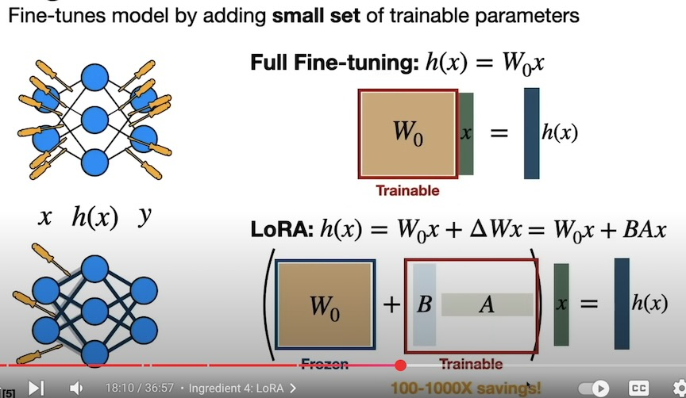

## Fine-tuning Tiny LLM on Your Data 

- Walk through sentiment analysis with TinyLlama and LoRA on a Single GPU
- The conventional paradigm is large-scale pretraining on generic web-scale data, followed by fine-tuning to downstream tasks. 
- Fine-tuning these pretrained LLMs on downstream datasets results in huge performance gains when compared to using the pretrained LLMs out-of-the-box [2]
	
### Why Fine-tuning Tiny LLM?

- Performs well on your custom task requires much less resources than getting a large LLM to do the same.
- get thousand good quality examples.
- Important benefit of fine-tuning a Tiny LLM is that you can control the prompt and output format.

### Parameter Efficient Fine-tuning (PEFT)

- However, as models get larger and larger, `full fine-tuning` becomes infeasible to train on consumer hardware. 
- In addition, storing and deploying fine-tuned models independently for each downstream task becomes very expensive, because fine-tuned models are the same size as the original pretrained model.
- `Parameter-Efficient Fine-tuning (PEFT)` approaches are meant to address both problems! 
	- PEFT approaches only fine-tune a small number of (extra) model parameters while freezing most parameters of the pretrained LLMs
	- thereby greatly decreasing the computational and storage costs. 
	- This also overcomes the issues of `catastrophic forgetting`, a behaviour observed during the full finetuning of LLMs. 
	- It also helps in portability wherein users can tune models using PEFT methods to get `tiny checkpoints` worth a few MBs compared to the large checkpoints of full fine-tuning

### Fine-tuning with LoRA

- Train a small model (adapter) on top of the original
- Tiny LLMs usually need more parameters (100M is good start)
- Increase rank (e.g. 128) to get the number of parameters
- Increase lora_alpha(e.g. 128) to scale the learning rate

#### Using PEFT & bitsandbytes to finetune a LoRa checkpoint [1][9]
- 
```python 
!pip install -q bitsandbytes datasets accelerate loralib
!pip install -q git+https://github.com/huggingface/transformers.git@main git+https://github.com/huggingface/peft.git

# Setup the model
# Colab: GPU 0: NVIDIA A100-SXM4-40GB (UUID: GPU-e422d711-e39a-eaa9-2988-783d144f55c1) (nvidia-smi -L)
import os
os.environ["CUDA_VISIBLE_DEVICES"]="0"
import torch
import torch.nn as nn
import bitsandbytes as bnb	# only work on cuda
from transformers import AutoTokenizer, AutoConfig, AutoModelForCausalLM

model = AutoModelForCausalLM.from_pretrained(
    "bigscience/bloom-7b1", 
    load_in_8bit=True, 
    device_map='auto',
)

tokenizer = AutoTokenizer.from_pretrained("bigscience/bloom-7b1")

# Freezing the original weights
for param in model.parameters():
  param.requires_grad = False  # freeze the model - train adapters later
  if param.ndim == 1:
    # cast the small parameters (e.g. layernorm) to fp32 for stability
    param.data = param.data.to(torch.float32)

model.gradient_checkpointing_enable()  # reduce number of stored activations
model.enable_input_require_grads()

class CastOutputToFloat(nn.Sequential):
  def forward(self, x): return super().forward(x).to(torch.float32)
model.lm_head = CastOutputToFloat(model.lm_head)  # cast the logits to fp32 for stability

# Setting up the LoRa Adapters
def print_trainable_parameters(model):
    """
    Prints the number of trainable parameters in the model.
    """
    trainable_params = 0
    all_param = 0
    for _, param in model.named_parameters():
        all_param += param.numel()
        if param.requires_grad:
            trainable_params += param.numel()
    print(
        f"trainable params: {trainable_params} || all params: {all_param} || trainable%: {100 * trainable_params / all_param}"
    )

from peft import LoraConfig, get_peft_model 

config = LoraConfig(
    r=16, #attention heads
    lora_alpha=32, #alpha scaling
    # target_modules=["q_proj", "v_proj"], #if you know the 
    lora_dropout=0.05,
    bias="none",
    task_type="CAUSAL_LM" # set this for CLM or Seq2Seq
)

model = get_peft_model(model, config)
print_trainable_parameters(model)
## trainable params: 7864320 || all params: 7076880384 || trainable%: 0.11112693126452029

# Data
import transformers
from datasets import load_dataset
data = load_dataset("Abirate/english_quotes")

def merge_columns(example):
    example["prediction"] = example["quote"] + " ->: " + str(example["tags"])
    return example

data['train'] = data['train'].map(merge_columns)
data['train']["prediction"][:5]

# Training

trainer = transformers.Trainer(
    model=model, 
    train_dataset=data['train'],
    args=transformers.TrainingArguments(
        per_device_train_batch_size=4, 
        gradient_accumulation_steps=4,
        warmup_steps=100, 
        max_steps=200, 
        learning_rate=2e-4, 
        fp16=True,
        logging_steps=1, 
        output_dir='outputs'
    ),
    data_collator=transformers.DataCollatorForLanguageModeling(tokenizer, mlm=False)
)
model.config.use_cache = False  # silence the warnings. Please re-enable for inference!
trainer.train()
# Share adapters on the 🤗 Hub
model.push_to_hub("samwit/bloom-7b1-lora-tagger",
                  use_auth_token=True,
                  commit_message="basic training",
                  private=True)
# Load adapters from the Hub
import torch
from peft import PeftModel, PeftConfig
from transformers import AutoModelForCausalLM, AutoTokenizer

peft_model_id = "samwit/bloom-7b1-lora-tagger"
config = PeftConfig.from_pretrained(peft_model_id)
model = AutoModelForCausalLM.from_pretrained(config.base_model_name_or_path, return_dict=True, load_in_8bit=True, device_map='auto')
tokenizer = AutoTokenizer.from_pretrained(config.base_model_name_or_path)

# Load the Lora model
model = PeftModel.from_pretrained(model, peft_model_id)
```

#### QLoRA—How to Fine-tune an LLM on a Single GPU 

- Memory usage for a 10GB model: 
	- 10B parameter Model = 160GB!
		- Parameters(FP16): 20GB
    	- Gradients(FP16): 20GB # Training purpose
    	- Optimizer States, Momentum Variance (FP32): 120GB
- What is Quantization?
	- Quantization = splitting range into buckets so as to minimize the memory footprint.
- 4 Ingredients of QLoRA:
	- 4-bit NormalFloat
		- A better way to bukcet numbers, 4 bits - 16 unique combs, uses equally-sized buckets based on model parameter distribution
	- Double Quantization
		- Quantizing the Quantization Constants, i.e. FP32 --> Int8 , rescale all parameters
	- Paged Optimiziers
		- Looping in your CPU, move memory as needed from GPU to CPU 
		- e.g. Phi-1 (1.3B) ~21GB of memory
	- LoRA: Find-tunes model by adding small set of trainable parameters 
		- 100-1000x savings 
- **Fine-tuning Mistral-7b-Instruction for YT Comments**
	- YT source [11], Medium source [12]
```python 
from transformers import AutoModelForCausalLM, AutoTokenizer, pipeline
from peft import prepare_model_for_kbit_training
from peft import LoraConfig, get_peft_model
from pfrom datasets import load_dataset
import transformers

## Load the model
model_name = "TheBloke/Mistral-7B-Instruct-v0.2-GPTQ"
model = AutoModelForCausalLM.from_pretrained(model_name,
                                             device_map="auto", # automatically figures out how to best use CPU + GPU for loading model
                                             trust_remote_code=False, # prevents running custom model files on your machine
                                             revision="main") # which version of model to use in repo
## Load tokenizer
tokenizer = AutoTokenizer.from_pretrained(model_name, use_fast=True)

## Use base model
model.eval() # model in evaluation mode (dropout modules are deactivated)

# craft prompt
comment = "Great content, thank you!"
prompt=f'''[INST] {comment} [/INST]'''

# tokenize input
inputs = tokenizer(prompt, return_tensors="pt")

# generate output
outputs = model.generate(input_ids=inputs["input_ids"].to("cuda"), max_new_tokens=140)

print(tokenizer.batch_decode(outputs)[0])

## Prompt Engineering
intstructions_string = f"""ShawGPT, functioning as a virtual data science consultant on YouTube, communicates in clear, accessible language, escalating to technical depth upon request. \
It reacts to feedback aptly and ends responses with its signature '–ShawGPT'. \
ShawGPT will tailor the length of its responses to match the viewer's comment, providing concise acknowledgments to brief expressions of gratitude or feedback, \
thus keeping the interaction natural and engaging.

Please respond to the following comment.
"""

prompt_template = lambda comment: f'''[INST] {intstructions_string} \n{comment} \n[/INST]'''

prompt = prompt_template(comment)

# tokenize input
inputs = tokenizer(prompt, return_tensors="pt")

# generate output
outputs = model.generate(input_ids=inputs["input_ids"].to("cuda"), max_new_tokens=140)

print(tokenizer.batch_decode(outputs)[0])

## Prepare Model for Training

model.train() # model in training mode (dropout modules are activated)

# enable gradient check pointing
model.gradient_checkpointing_enable()

# enable quantized training
model = prepare_model_for_kbit_training(model)

# LoRA config
config = LoraConfig(
    r=8,
    lora_alpha=32,
    target_modules=["q_proj"],
    lora_dropout=0.05,
    bias="none",
    task_type="CAUSAL_LM"
)

# LoRA trainable version of model
model = get_peft_model(model, config)

# trainable parameter count
model.print_trainable_parameters()

# trainable params: 2,097,152 || all params: 264,507,392 || trainable%: 0.7928519441906561

## Preparing Training Dataset

# load dataset
data = load_dataset("shawhin/shawgpt-youtube-comments")
# create tokenize function
def tokenize_function(examples):
    # extract text
    text = examples["example"]

    #tokenize and truncate text
    tokenizer.truncation_side = "left"
    tokenized_inputs = tokenizer(
        text,
        return_tensors="np",
        truncation=True,
        max_length=512
    )

    return tokenized_inputs

# tokenize training and validation datasets
tokenized_data = data.map(tokenize_function, batched=True)
# setting pad token
tokenizer.pad_token = tokenizer.eos_token
# data collator
data_collator = transformers.DataCollatorForLanguageModeling(tokenizer, mlm=False)

## Fine-tuning Model
# hyperparameters
lr = 2e-4
batch_size = 4
num_epochs = 10

# define training arguments
training_args = transformers.TrainingArguments(
    output_dir= "shawgpt-ft",
    learning_rate=lr,
    per_device_train_batch_size=batch_size,
    per_device_eval_batch_size=batch_size,
    num_train_epochs=num_epochs,
    weight_decay=0.01,
    logging_strategy="epoch",
    evaluation_strategy="epoch",
    save_strategy="epoch",
    load_best_model_at_end=True,
    gradient_accumulation_steps=4,
    warmup_steps=2,
    fp16=True,
    optim="paged_adamw_8bit",

)
# configure trainer
trainer = transformers.Trainer(
    model=model,
    train_dataset=tokenized_data["train"],
    eval_dataset=tokenized_data["test"],
    args=training_args,
    data_collator=data_collator
)


# train model
model.config.use_cache = False  # silence the warnings. Please re-enable for inference!
trainer.train()

# renable warnings
model.config.use_cache = True


```





## References 	
[1] Fine-tuning LLMs with PEFT and LoRA: https://www.youtube.com/watch?v=Us5ZFp16PaU  
[2] PEFT: Parameter-Efficient Fine-Tuning of Billion-Scale Models on Low-Resource Hardware: https://huggingface.co/blog/peft  
[3] Dataset: https://drive.google.com/uc?id=1rlX7CjTBeFLz2lvjaM1RbFGOX9beALQz  
[4] LORA: LOW-RANK ADAPTATION OF LARGE LANGUAGE MODELS: https://arxiv.org/pdf/2106.09685  
[5] Prefix Tuning: P-Tuning v2: Prompt Tuning Can Be Comparable to Fine-tuning Universally Across Scales and Tasks: https://arxiv.org/pdf/2110.07602  
[6] Prompt Tuning: The Power of Scale for Parameter-Efficient Prompt Tuning: https://arxiv.org/pdf/2104.08691  
[7] P-Tuning: GPT Understands, Too: https://arxiv.org/pdf/2103.10385  
[8] An Empirical Investigation of Catastrophic Forgetting in Gradient-Based Neural Networks: https://arxiv.org/abs/1312.6211  
[9] Using PEFT & bitsandbytes to finetune a LoRa Checkpoint: https://colab.research.google.com/drive/14xo6sj4dARk8lXZbOifHEn1f_70qNAwy?usp=sharing  
[10] bitsandbytes: https://github.com/bitsandbytes-foundation/bitsandbytes  
[11] QLoRA—How to Fine-tune an LLM on a Single GPU ： https://www.youtube.com/watch?v=XpoKB3usmKc  
[12] QLoRA Medium: https://medium.com/data-science/qlora-how-to-fine-tune-an-llm-on-a-single-gpu-4e44d6b5be32

