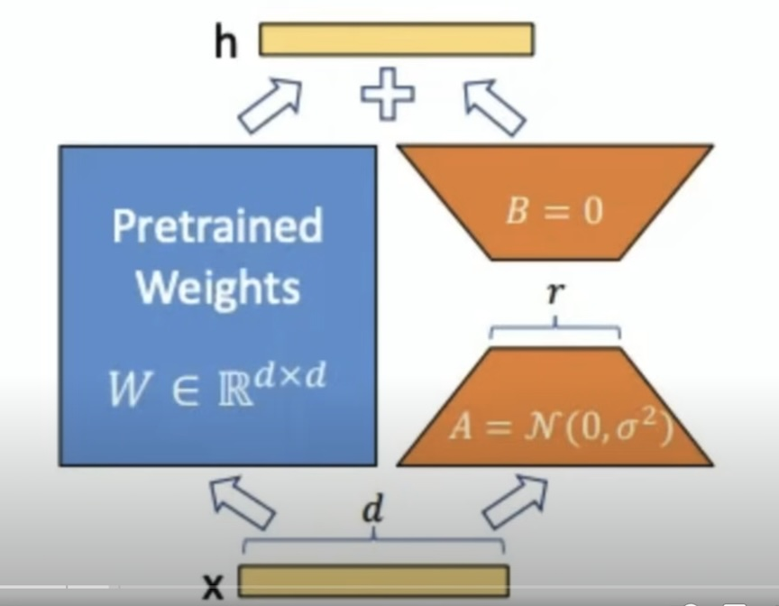
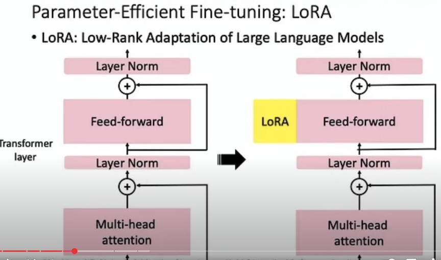

## LLM fine tuning 
	
- Take a pre-trained model and training at least one model parameter.
- Base model devinci GPT-3 --  fine tuned model text-davinci-003
- Large language model (LLM) fine-tuning is the process of taking 
	- a pre-trained models and further training them on smaller, specific datasets to refine their capabilities and 
	- improve performance in a particular task or domain.
- While fine-tuning can be highly computationally intensive, new techniques like `Parameter-Efficient Fine-Tuning (PEFT`)` are making it much more efficient and possible to run even on consumer hardware.

### Why fine-tune

- A smaller (fine-tuned) model can outperform a larger base model
- InstuctGPT(1.3B) >  GPT-3 (175B)

### Ways to fine-tune

- Self-supervised learning
	- Definition: Training on labeled task-specific data to adjust model parameters.
	- Curate your training corpus to align with your applcation. Say fine-tune GPT-3 on writting text in the likeness.

- Supervised learning
	- training datasets consist both inputs and associated outputs. i.e. a set of question/answer pairs
	- use prompt templates

- reinforcement learning
			
### Fine-tune LLMs 
(1) Supervised FT 
(2) Train reward Model   	
(3) Reinforcement learning with PPO	

#### Supervised Fine-turning 
- Choose fine-tuning task
- Prepare training dataset
- Choose a base model
- Fine-tune model via supervised learning
- Evaluate model performance

#### Options for Parameter Training
- **Retrain all parameters**
	- downside is that high computational cost of training

- **Transfer learning** 
	- freeze most of the parameters, only fine tune the head, namely we fine-tune the last few layers of the model
	- last few layers bear the model embeddings or internal representations
	- transfer learning is a lot cheapter than retraining all parameters

- **Parameter Efficient Fine-tuning (PEFT)**
	- freeze all weights 
	- augement model with additional parameters which are trainable
	- relatively small set of new parameters. 
	- LoRA (Low-Rank Adaptation). Fine-tunes model by adding new trainable parameters 
		- x --> h(x) , h: hidden layer, h(x) = W0 * x + deltaW * x, deltaW is same size as W0, deltaW = B * A
		- h(x) = (W0 + B * A) * x
		- W0 is frozen, B and A are trainable, W0: dxk, B: dxr, A: rxk, r is very small, B and A contain far fewer parameters than W0
		- d, k = 1000, r = 2, only 4000 new parameters need to be trained    
						
		- example:
			- base model 
				- distiled version of the BERT base model, https://huggingface.co/distilbert-base-uncased
				- only 67 M parameters 
			- dataset
				- shawhin/imdb-truncated
				- available on hugging-face 

			- Preprocessing data
				- create tokenizer
				- tokenization is a critical step when working with LLMs
				- Neural networks only understand the numbers instead of texts

## References
[1] Fine-Tuning Large Language Models (LLMs): https://medium.com/towards-data-science/fine-tuning-large-language-models-llms-23473d763b91  
[2] Fine-Tuning LLMs: Overview, Methods, and Best Practices: https://www.turing.com/resources/finetuning-large-language-models  
[3] Fine-tuning large language models (LLMs) in 2025: https://www.superannotate.com/blog/llm-fine-tuning  
[4] Fine-Tuning LLMs: Top 6 Methods, Challenges and Best Practices: https://www.acorn.io/resources/learning-center/fine-tuning-llm/  
[5] Fine-Tuning Llama 2 with Hugging Face PEFT Library: https://www.acorn.io/resources/learning-center/fine-tuning-llama-2/  
[6] Fine-Tuning LLMs with PEFT and LoRA: https://www.youtube.com/watch?v=Us5ZFp16PaU  
